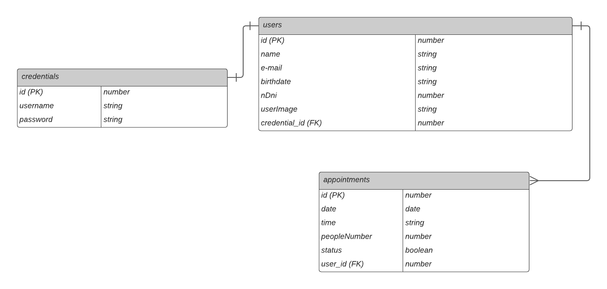

# **PROYECTO MÓDULO 3: GESTOR DE TURNOS**

Para el tercer Proyecto Integrador (PI) del Bootcamp, se requiere crear una app que opere como un gestor de turnos para clientes de cierto servicio. En este caso, el servicio será un restaurante, y la app consistirá en una web para que usuarios puedan realizar reservas de una mesa en el mismo. Para este proyecto, no se manejará stock, es decir, más de un usuario podrá reservar la misma mesa en un mismo horario.

El horario de atención del restaurante será de **12:00 a 16:00 y de 19:00 a 23:00, de lunes a viernes**, y es durante estos mismos horarios que la web estará disponible para realizar reservas. El tiempo que durará la reserva es de 30 minutos, y puede ser cancelada hasta 24 horas antes de la fecha de la misma. No se aceptan reprogramaciones, tampoco la reserva de más de un turno diario. Solo se pueden hacer reservas con máximo dos semanas de anticipación.

Para la correcta identificación de quienes reservan una mesa en el restaurante, sólo se aceptarán reservas de usuarios que se encuentren registrados en la web, por lo que al rellenar un formulario básico ya estarán habilitados para gestionar sus turnos, con la posibilidad de revisar todo el historial de turnos a detalle.

Cuando el usuario cree su cuenta, y también cuando reserve o cancele un turno, este recibirá en su casilla de correo la bienvenida a la página o la información de su reserva/cancelación, según corresponda. Además, podrá subir una foto de perfil que lo identifique. 

## UX/UI

* Barra de menú  
  * Sobre Nosotros.
  * Mapa de Mesas.
  * Login.

* Landing
  * Bienvenida, acompañada de una fotografía del exterior del recinto.
  * Presentación de la barra de menú en los laterales de la foto.

* Panel de Usuario  
  * Visualizar turnos: Fecha, hora, detalle y status.
  * Agendar turnos.
  * Cancelar turnos.
  * Datos de Usuario.

* Formularios  
  * Validaciones en tiempo real.  
  * Habilitar botón al completar todos los campos. 
  * Restringir oferta de fecha y hora.

* Footer
  * Contacto.
  * Redes Sociales.

## Historia de Usuario

**Como usuario invitado:**

* Como usuario invitado quiero poder ingresar al home y ver algo de contenido.  
* Como usuario invitado quiero poder registrarme y crear una cuenta nueva.

**Como usuario registrado:**

* Como usuario registrado nuevo quiero recibir un correo electrónico dándome la bienvenida.  
* Como usuario registrado quiero poder iniciar sesión con mis credenciales.  
* Como usuario registrado quiero poder agregar una foto de perfil que me identifique.  
* Como usuario registrado quiero poder reservar un turno durante el horario de atención del restaurante.  
* Como usuario registrado quiero poder elegir una mesa específica.  
* Como usuario registrado quiero recibir un correo cuando reserve un turno.  
* Como usuario registrado quiero tener acceso a la visualización de todo mi historial de turnos al detalle.
* Como usuario registrado quiero poder cancelar un turno hasta un día antes.  
* Como usuario registrado quiero recibir un correo cuando cancele un turno.  
* Como usuario registrado quiero poder cerrar sesión cuando no seguiré usando la plataforma.

**Como usuario administrador:**

* Como usuario administrador quiero poder modificar días laborales y rangos horarios.

## Diagrama Entidad \- Relación
Respecto a la estructura de la base de datos correspondiente a la información del proyecto, incluimos las siguientes entidades, sus relaciones, y sus respectivos atributos:

